# Flowproxy CLI

A professional, cross-platform traffic diversion manager for OpenWrt and Linux.

## 1. Logic Flow Diagram

```mermaid
graph TD
    Start[CLI Start] --> FlagParse[Parse Flags & Detect Env]
    FlagParse --> Env{Platform?}
    
    Env -- OpenWrt --> P_OW[OpenWrtPlatform: UCI + Firewall Restart]
    Env -- Linux   --> P_LX[LinuxPlatform: Systemd + Systemctl]
    
    FlagParse --> FW{Firewall?}
    FW -- nftables --> E_NFT[NftablesEngine: nft -f atomic]
    FW -- iptables --> E_IPT[IptablesEngine: iptables + ipset]

    subgraph "Action: preview"
        Pre_Req[Check Requirements] --> Pre_Chn[Fetch Chnroute]
        Pre_Chn --> Pre_Gen[Generate Strategy & Mock Script]
        Pre_Gen --> Pre_Val[Syntax Dry-run]
        Pre_Val --> Pre_Out[Display Report]
    end

    subgraph "Action: install"
        Ins_Req[Check Requirements] --> Ins_Chn[Fetch Chnroute]
        Ins_Chn --> Ins_Gen[Generate Full Script]
        Ins_Gen --> Ins_Val[Strict Validation]
        Ins_Val --> Ins_Save[Save to /usr/bin]
        Ins_Save --> Ins_Exec[Exec Start logic]
        Ins_Exec --> Ins_Persist[Register UCI/Systemd]
        Ins_Persist --> Ins_Reload[Reload Service]
    end

    subgraph "Action: uninstall"
        Uni_Stop[Exec Stop logic] --> Uni_Kernel[Clean PBR & Rules]
        Uni_Kernel --> Uni_Unreg[Remove UCI/Systemd]
        Uni_Unreg --> Uni_Reload[Reload Service]
        Uni_Reload --> Uni_Del[Delete Script File]
    end
```



## 2. Technical Stack
- **Language**: Go (Standard Library Only)
- **Engines**: 
  - **Nftables**: Atomic transactions via `nft -f`.
  - **Iptables**: High-performance IP sets via `ipset`.
- **Platforms**: 
  - **OpenWrt**: Deep integration with `firewall` include and `uci`.
  - **Generic Linux**: Full lifecycle management via `systemd`.

## 3. Deployment Strategy
### OpenWrt
- **Installation**: Compiled logic is saved as a shell script and registered as a firewall include.
- **Persistence**: Survival across reboots and firewall reloads via UCI.
- **Control**: Professional service management via `/etc/init.d/firewall`.

### Generic Linux
- **Installation**: Compiled logic is saved as a shell script and a Systemd unit is created.
- **Persistence**: Standard Systemd enabling mechanism.
- **Control**: Standard management via `systemctl`.

## 4. Compilation
```bash
GOOS=linux GOARCH=amd64 go build -ldflags="-s -w" -o flowproxy-cli .
```
