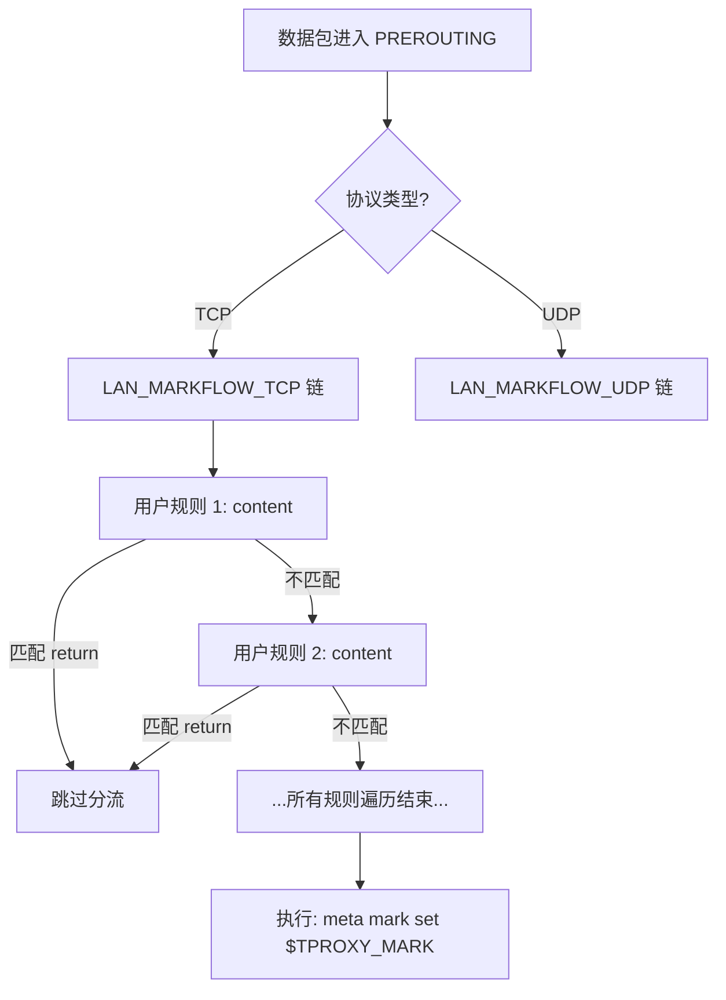

# FlowProxy - LuCI Traffic Diversion Application

基于 nftables 的 LuCI 流量分流应用，用于在路由器/网关上按照特定规则分流部分流量到指定的代理软件。

## 功能特性

- **设置模块**：服务启停、代理 IP 配置、TPROXY 标记设置及运行状态监控。
- **规则管理 (New!)**：支持直接编写 `nftables` 规则语句，支持拖拽排序、一键应用预设模板。
- **名单管理**：管理全局 `nftables set` 集合（源 MAC、源 IP、目标 IP、端口等），可在规则中直接引用。
- **配置预览**：实时预览生成的完整 `nftables` 配置文件。

## 项目结构

```
luci-app-flowproxy/
├── Makefile                           # OpenWrt 编译配置
├── README.md                          # 项目说明
├── htdocs/luci-static/resources/view/flowproxy/
│   ├── settings.js                    # 设置页面
│   ├── rules.js                       # 规则管理页面 (GridSection + Templates)
│   ├── lists.js                       # 名单管理页面
│   └── preview.js                     # 配置预览页面
├── root/
│   ├── etc/
│   │   ├── config/flowproxy           # UCI 配置文件 (包含 rule 和 nftset)
│   │   └── init.d/flowproxy           # 服务启动脚本
│   └── usr/share/
│       ├── luci/menu.d/
│       │   └── luci-app-flowproxy.json  # 菜单定义
│       ├── rpcd/
│       │   └── luci.flowproxy           # ucode 后端脚本
│       └── flowproxy/
│           ├── chnroute.txt             # 中国 IP 列表
│           └── generate_nft.sh          # 核心 nft 规则生成脚本
└── po/zh_Hans/
    └── flowproxy.po                   # 简体中文翻译
```

## 使用方法

### 1. 基本设置
进入 **服务 → FlowProxy → 设置**：启用服务、配置代理服务器 IP（用于防止回路）和 TPROXY 标记。

### 2. 规则配置 (灵活模式)
进入 **服务 → FlowProxy → 规则**：
- **自定义编写**：您可以直接输入 `nftables` 匹配语句，例如 `ip daddr 192.168.100.0/24 return`。
- **引用名单**：使用 `@` 前缀引用在“名单管理”中定义的集合。
- **快速模版**：页面下方提供了一系列常用模版按钮（如“跳过中国 IP”、“跳过私有地址”等），点击即可快速添加。
- **动作执行**：通常使用 `return` 动作来表示“跳过代理”。未被任何规则 `return` 的流量最终会被打上分流标记。

### 3. 名单管理
进入 **服务 → FlowProxy → 名单**：在这里维护各种 IP、MAC 或端口列表。这些名单会被定义为 `nftables set`。

---

## 规则处理流程

流量进入 `prerouting` 钩子后，会依次经过用户定义的规则链。如果匹配到带有 `return` 动作的规则，该数据包将退出当前链并跳过分流标记。



## 预定义占位符

在规则 `content` 中，您可以使用以下占位符：
- `@no_proxy_src_mac`: 不走代理的源 MAC 列表
- `@no_proxy_src_ip_v4`: 不走代理的源 IPv4 列表
- `@no_proxy_dst_ip_v4`: 不走代理的目标 IPv4 列表
- `@private_dst_ip_v4`: 私有 IP 地址段 (10.0.0.0/8 等)
- `@chnroute_dst_ip_v4`: 中国 IP 地址段
- `@no_proxy_dst_tcp_ports`: 不走代理的 TCP 端口
- `@no_proxy_dst_udp_ports`: 不走代理的 UDP 端口
- `@proxy_server_ip`: 自动替换为“设置”中配置的代理服务器 IP

## 示例配置 (UCI)

```uci
config rule
	option name 'Skip China IP'
	option protocol 'both'
	option enabled '1'
	option content 'ip daddr @chnroute_dst_ip_v4 return'

config rule
	option name 'Custom Skip Network'
	option protocol 'tcp'
	option enabled '1'
	option content 'ip daddr 10.1.2.0/24 return'
```

---

## 依赖

- `nftables`
- `rpcd-mod-ucode`
- `ucode-mod-uci`
- `ucode-mod-fs`

## 许可证

Apache License 2.0
