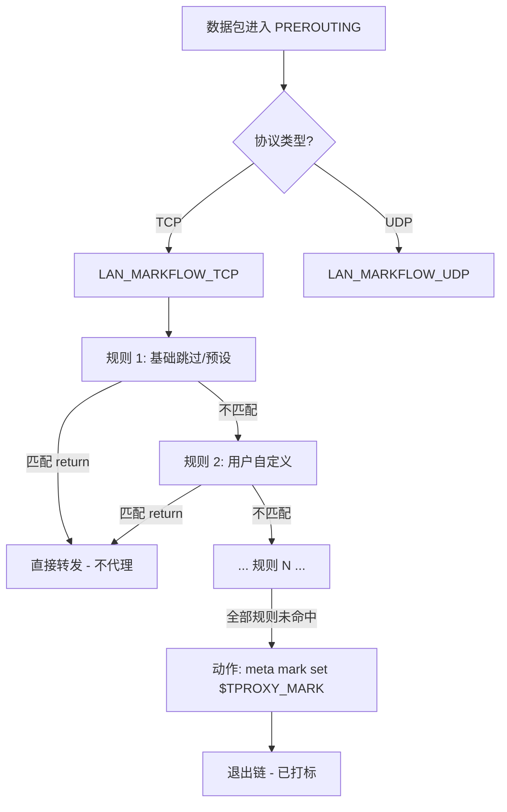
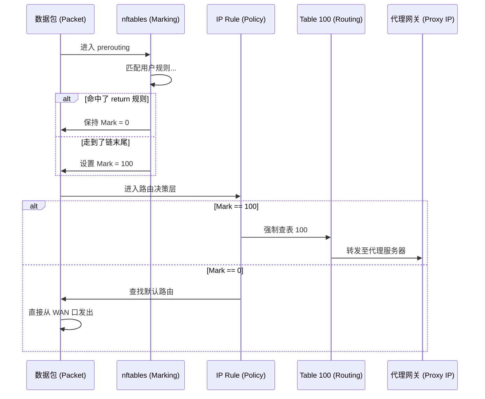

# FlowProxy - LuCI Traffic Diversion Application

基于 nftables 的 LuCI 流量分流应用，用于在路由器/网关上按照自定义规则将流量定向到指定的代理服务器。

## 功能特性

- **设置模块**：服务启停、代理 IP 配置、TPROXY 标记设置及运行状态监控。
- **规则管理 (New!)**：支持直接编写 `nftables` 匹配语句，支持拖拽排序、一键应用预设模板。
- **名单管理**：管理全局 `nftables set` 集合，可在规则中直接引用。
- **配置预览**：实时预览生成的完整 `nftables` 配置文件。

## 项目结构

```
luci-app-flowproxy/
├── Makefile                           # OpenWrt 编译配置
├── htdocs/luci-static/resources/view/flowproxy/
│   ├── settings.js                    # 设置页面
│   ├── rules.js                       # 规则管理页面 (GridSection + Templates)
│   ├── lists.js                       # 名单管理页面
│   └── preview.js                     # 配置预览页面
├── root/
│   ├── etc/
│   │   ├── config/flowproxy           # UCI 配置文件 (包含 rule 和 nftset)
│   │   └── init.d/flowproxy           # 服务启动脚本 (调用规则生成器并配置路由)
│   └── usr/share/
│       ├── luci/menu.d/
│       │   └── luci-app-flowproxy.json  # 菜单定义
│       ├── rpcd/
│       │   └── luci.flowproxy           # ucode 后端脚本
│       └── flowproxy/
│           ├── chnroute.txt             # 中国 IP 列表
│           └── generate_nft.sh          # 核心规则生成器 (将 UCI 转换为 nft-f 格式)
└── README.md                          # 本项目说明
```

---

## 核心原理：数据包分流流程

FlowProxy 的核心逻辑在于 **"标记与重路由" (Mark & Reroute)**。

### 1. 规则匹配流程 (Netfilter 链)
当数据包经过 `PREROUTING` 钩子时，会进入由用户定义的规则链。



**关键逻辑说明：**
- **顺序执行**：规则按优先级（Priority）排序执行。
- **Return 即跳过**：规则内容中若包含 `return`（如 `ip daddr @chnroute_dst_ip_v4 return`），一旦命中，该包立即退出当前链，保持默认标记 0。
- **末尾打标**：如果一个包没有被任何 `return` 规则拦截，它将到达链的末尾，被强制打上 `TPROXY_MARK`。

### 2. 路由分流流程 (策略路由)
内核根据包上的标记决定其下一跳路径。



---

## 规则编写指南

您可以在规则的 `content` 字段中使用任何标准的 `nftables` 匹配语法。

### 预定义占位符
- `@proxy_server_ip`: 自动替换为“设置”页面配置的代理服务器 IP，防止环路。
- `@no_proxy_src_mac`: 引用在“名单”页面配置的 MAC 黑名单。
- `@private_dst_ip_v4`: 私有地址段（192.168.x.x, 10.x.x.x 等）。
- `@chnroute_dst_ip_v4`: 中国 IP 列表。

### 示例场景
1.  **特定内网设备不走代理**：
    `ip saddr 192.168.1.50 return`
2.  **特定目标端口走代理** (假设默认是跳过)：
    如果您修改了生成逻辑或默认规则，可以反向操作，但通常我们采用“默认代理，特定跳过”的黑名单模式。
3.  **完全直连某个网站 IP**：
    `ip daddr 1.2.3.4 return`

---

## 命令行调试工具

如果您需要排查规则是否生效，可以使用以下命令：

```bash
# 查看生成的最终配置
cat /tmp/flowproxy_nft.conf

# 查看运行中的规则计数器 (确认数据包是否命中)
nft list chain inet flowproxy LAN_MARKFLOW_TCP

# 检查策略路由
ip rule show
ip route show table 100

# 查看代理服务器连通性
ping $(uci get flowproxy.global.proxy_ip)
```

## 依赖
- `nftables`, `rpcd-mod-ucode`, `ucode-mod-uci`, `ucode-mod-fs`

## 许可证
Apache License 2.0
